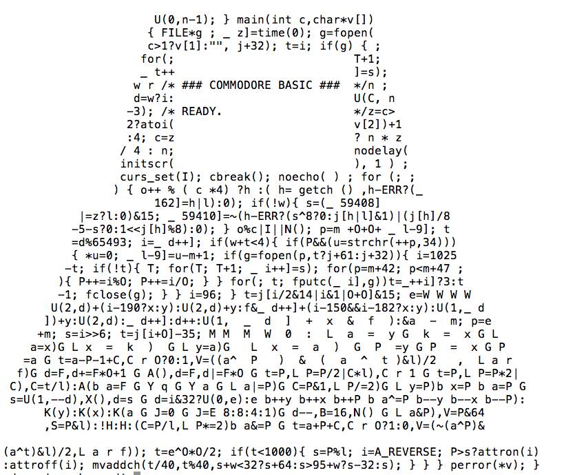

ioccc-6502
==========

6502 and PET emulator from Stephen Sykes' IOCCC submission - see http://www.ioccc.org/2005/sykes/

The purpose here is to host a bug-fixed version of the emulator, and some efforts at deobfuscation.  See the [hint.text](hint.text) file for details of how to run it. (To run as a PET you will need a ROM image - instructions in the hint file.)

The original submission doesn't successfully run the in-ROM machine monitor, which alerted me to the possibility of bugs.  Other than the absence of decimal mode (which is a relatively common omission and a relatively harmless one) I found these:
* BRK should be a 2-byte opcode
* Bit 4 of the pushed status byte (P) must be zero when pushed by IRQ and otherwise one.

To find the bugs I ran Klaus Dormann's test suite. The emulator formerly failed and now passes (up to decimal mode.)

Here's a screenshot of the code:

See also the post on gplus by mos6502 [here](https://plus.google.com/u/0/108984290462000253857/posts/G11Df2pw6DP).

The rules at the time for submissions to the International Obfuscated C Code Contest put winning entries into the public domain - so I've applied a CC0 license.
